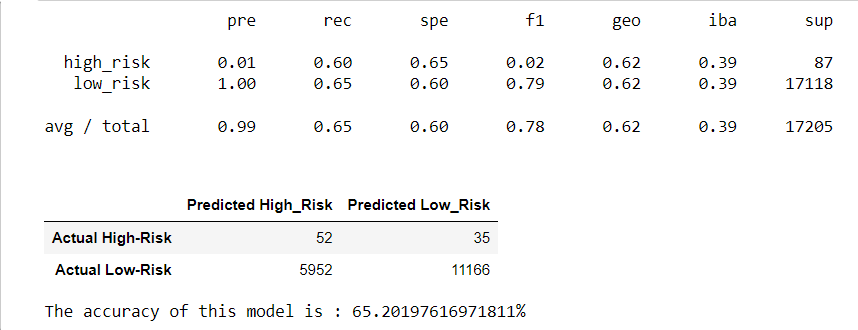
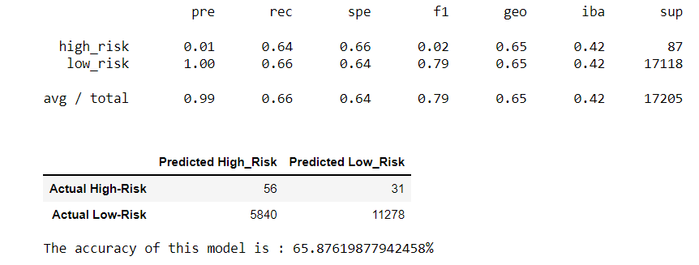
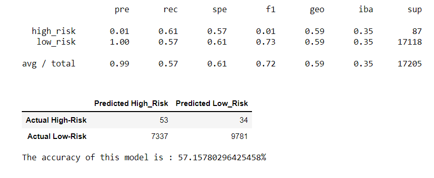
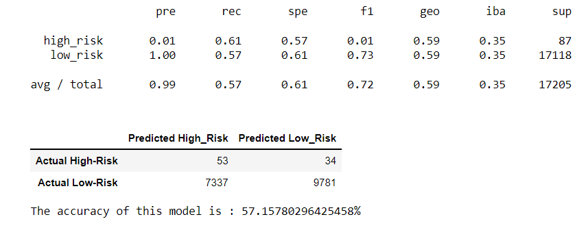
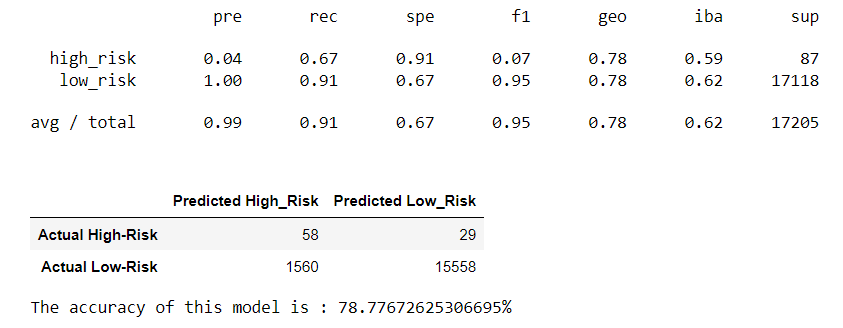
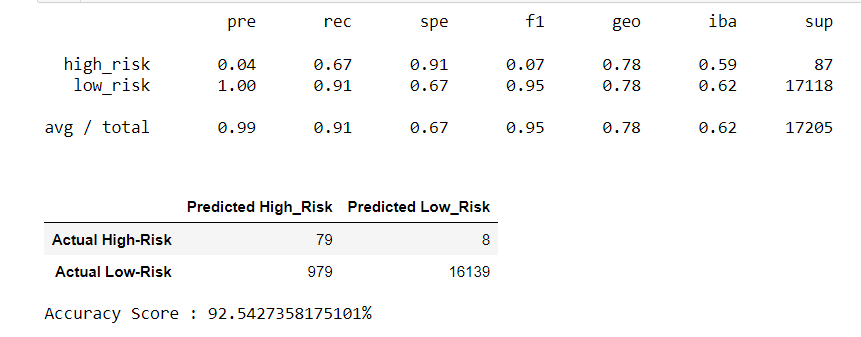

# Credit_Risk_Analysis

## Overview

Credit risk is an inherently unbalanced classification problem, as good loans easily outnumber risky loans. Different techniques employed to train and evaluate machine learning models with unbalanced classes can help analyze applications and its features for use in predicting credit risk. Using `imbalanced-learn` and `scikit-learn` libraries, we will build and evaluate models using resampling to analyze risk.

Using the credit card credit dataset from LendingClub, a peer-to-peer lending services company, the data will be oversampled using the `RandomOverSampler` and `SMOTE` algorithms, and undersampled using the `ClusterCentroids` algorithm. Then, using a combinatorial approach of over- and undersampling using the `SMOTEENN` algorithm. Next, compare two new machine learning models that reduce bias, `BalancedRandomForestClassifier` and `EasyEnsembleClassifier`, to predict credit risk. Once done, evaluate the performance of these models and make a written recommendation on whether they should be used to predict credit risk. 

### Data and Resources

- Data
  - LoanStatus_2019Q1.csv

- Resources
  - [Jupyter Notebook 6.3.0](https://jupyter-notebook.readthedocs.io/en/stable/index.html)   
  - [Python v 3.8.8](https://docs.python.org/release/3.8.8/installing/index.html)
  - Anaconda v 4.11.0
  - [imbalanced-learn](https://imbalanced-learn.org/stable/install.html)
  - [scikit-learn](https://imbalanced-learn.org/stable/install.html)

## Results

### Resample Models For Predicting Credit Risk

Using the `imbalanced-learn` and `scikit-learn` libraries, three machine learning models will be evaluated by using resampling to determine which is better at predicting credit risk. First, the oversampling `RandomOverSampler` and `SMOTE algorithms`, and then the undersampling `ClusterCentroids` algorithm will be used. Using these algorithms, the dataset will be resampled, the count of the target classes can be viewed, and a logistic regression classifier trained. Then, the balanced accuracy score can be caculated, along with generating a confusion matrix, and a classification report.

#### Naive Random Oversampling

1. Resample the data:

```Python
from imblearn.over_sampling import RandomOverSampler
ros = RandomOverSampler(random_state=1)
X_resampled, y_resampled = ros.fit_resample(X_train, y_train)
Counter(y_resampled)
```

2. Train a logistic regression classifier:

```Python
from sklearn.linear_model import LogisticRegression
classifier = LogisticRegression(random_state=1)
classifier.fit(X_resampled, y_resampled)
y_pred = classifier.predict(X_test)
```

3. Calculate the accuracy of the model:

```Python
from sklearn.metrics import accuracy_score
print(accuracy_score(y_test, y_pred))
```

4. Generate a confusion matrix:

```Python
from sklearn.metrics import confusion_matrix, classification_report 

matrix = confusion_matrix(y_test, y_pred)
cm_df = pd.DataFrame(
    matrix, index=["Actual High-Risk", "Actual Low-Risk"], columns=["Predicted High_Risk", "Predicted Low_Risk"])
cm_df
```

5. Print the imbalanced classification report:

```Python
from imblearn.metrics import classification_report_imbalanced 
print(classification_report_imbalanced(y_test, y_pred))
```



#### SMOTE

1. Resample the data:

```Python
from imblearn.over_sampling import SMOTE
X_resampled, y_resampled = SMOTE(random_state=1,
sampling_strategy='auto').fit_resample(
   X_train, y_train)
```

> The following steps repeat the same code as the previous model to create and train a model, calculate the accuracy, generate confusion matrix, and imbalanced classification report
 
2. Train a logistic regression classifier

3. Calculate the accuracy of the model

4. Generate a confusion matrix

5. Print the imbalanced classification report



#### Undersampling

1. Resample the data using the ClusterCentroids resampler:

```Python
# Warning: This is a large dataset, and this step may take some time to complete
from imblearn.under_sampling import RandomUnderSampler
rus = RandomUnderSampler(random_state=1)
X_resampled, y_resampled = rus.fit_resample(X_train, y_train)
Counter(y_resampled)
```
> The following steps repeat the same code as the previous model to create and train a model, calculate the accuracy, generate confusion matrix, and imbalanced classification report
 
2. Train a logistic regression classifier

3. Calculate the accuracy of the model

4. Generate a confusion matrix

5. Print the imbalanced classification report



#### Combination (Over- and Under- sampling)

Next, using a combinatorial approach of over- and undersampling with the `SMOTEENN` algorithm, the results from the combinatorial approach can be compared with the previous models to see which can best predict credit risk. Using the `SMOTEENN` algorithm, resample the dataset, view the target classes, train a logistic regression classifier, calculate the balanced accuracy score, generate a confusion matrix, and generate a classification report.

1. Resample the training data with SMOTEENN:

```Python
# Warning: This is a large dataset, and this step may take some time to complete
from imblearn.combine import SMOTEENN

smote_enn = SMOTEENN(random_state=1)
X_resampled, y_resampled = smote_enn.fit_resample(X, y)
Counter(y_resampled)
```
> The following steps repeat the same code as the previous model to create and train a model, calculate the accuracy, generate confusion matrix, and imbalanced classification report
 
2. Train a logistic regression classifier

3. Calculate the accuracy of the model

4. Generate a confusion matrix

5. Print the imbalanced classification report



### Ensemble Classifiers to Predict Credit Risk

Lastly, train and compare two different ensemble classifiers, `BalancedRandomForestClassifier` and `EasyEnsembleClassifier`, to predict credit risk and evaluate each model. Using both algorithms, resample the dataset, view the count of the target classes, train the ensemble classifier, calculate the balanced accuracy score, generate a confusion matrix, and generate a classification report.

#### Random Forest Classifier

Using the previous models, while consulting [this](https://imbalanced-learn.org/stable/references/generated/imblearn.ensemble.BalancedRandomForestClassifier.html) documentation, as examples:

1. Resample the dataset using the `BalancedRandomForestClassifier` algorithm:

```Python
from imblearn.ensemble import BalancedRandomForestClassifier

# Create a random forest classifier model
brf = BalancedRandomForestClassifier(n_estimators=100, random_state=1)

# Fit the model 
brf.fit(X_train, y_train)

# Make predictions using the testing data
predictions = brf.predict(X_test)
```
> The following steps repeat the same code as the previous model to create and train a model, calculate the accuracy, generate confusion matrix, and imbalanced classification report
 
2. Calculate the accuracy of the model

3. Generate a confusion matrix

4. Print the imbalanced classification report



### Easy Ensemble Classifier

Using the previous models, while consulting [this](https://imbalanced-learn.org/stable/references/generated/imblearn.ensemble.EasyEnsembleClassifier.html) documentation, as examples:

1. Resample the dataset using the `EasyEnsembleClassifier` algorithm:

```Python
from imblearn.ensemble import EasyEnsembleClassifier
eec = EasyEnsembleClassifier(n_estimators=100, random_state=1)
eec.fit(X_train, y_train) 
y_predict = eec.predict(X_test)
```

> The following steps repeat the same code as the previous model to create and train a model, calculate the accuracy, generate confusion matrix, and imbalanced classification report

2. Calculate the accuracy of the model

3. Generate a confusion matrix

4. Print the imbalanced classification report



## Summary

  After running these models, the `EasyEnsembleClassifier` had the highest accuracy score of **92.5%**. An accuracy score is not always an appropriate or a meaningful performance metric, however.

  Imagine the following scenario, in which a credit card company wishes to detect fraudulent transactions in real time. Historically, out of 100,000 transactions, 10 have been fraudulent. An analyst writes a program to detect fraudulent transactions, but due to an uncaught bug, it flags every transaction as not fraudulent. Out of 100,000 transactions, it correctly classifies the 99,990 transactions that are not fraudulent, and it erroneously classifies all 10 transactions that are fraudulent. The program's accuracy score appears to be impressive at 99.99%. However, it fails spectacularly at its job, detecting 0 out of 10 fraudulent transactions, a success rate of 0%. 
  
  Precision is a measure of how reliable a positive classification is, in this case all actual "high-risk" or "low-risk" individuals. This model was not precise in predicting `high_risk` individuals, but perfect at predicting `low_risk` individuals (.07 and 1.00, respectively). Part of this could be attributed to sample size and would be difficult to adjust, even with normalization or scaling the data. However, compared to the other models run this performs relatively the same. The difference is in every other category in this imbalance classification report, which includes recall (sensitivity), and specificity scores. 

  The `EasyEnsembleClassifier` has high sensitivity and specificity for both `high_risk` and `low_risk` categories, but a low f1 score. The f1 score measures the 'imbalance' between the precision and sensitivity measures, which is why the f1 score is low for the `high_risk` category. There are always trade-offs when choosing models that favor precision or sensitivity. If precision measures positive predictive value, sensitivity measures the ratio of true positives and the sum of true positives and false negatives. High sensitivity is a more broad measure of 'true' values compared to precise measures. 
  
  In summary, there's a fundamental tension between precision and sensitivity. Highly sensitive tests and algorithms tend to be aggressive, as they do a good job of detecting the intended targets, but also risk resulting in a number of false positives. High precision, on the other hand, is usually the result of a conservative process, so that predicted positives are likely true positives; but a number of other true positives may not be predicted. In practice, there is a trade-off between sensitivity and precision that requires a balancing act between the two. 
